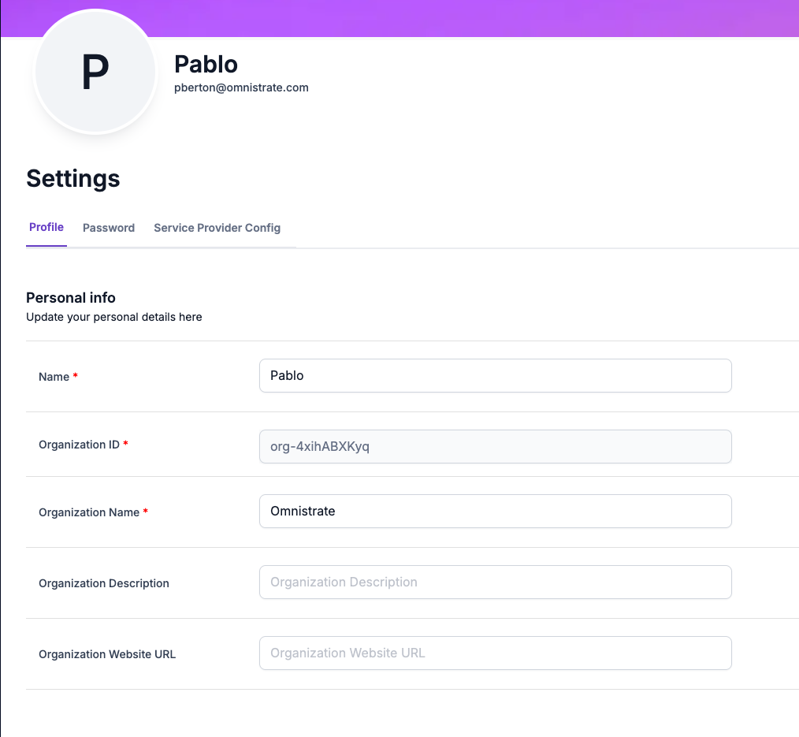

# Omnistrate Licensing SDK for Java

 


## Overview

[omnistrate-licensing-sdk-java](https://github.com/omnistrate-oss/omnistrate-licensing-sdk-java) is an SDK that allows you to validate license files generated by Omnistrate. 

## How to get the SDK

You can get the package from Maven Central:

```xml
<dependency>
    <groupId>om.omnistrate.licensing</groupId>
    <artifactId>omnistrate-licensing-sdk-java</artifactId>
    <version>${LATEST_VERSION}</version>
</dependency>
```

For more details, visit: [Maven Central](https://central.sonatype.com/artifact/com.omnistrate.licensing/omnistrate-licensing-sdk-java)

## Usage Examples

### Pre-requisites

The `Licensing` feature needs to be enabled for the service plan. When enabling the feature, a product identifier can be optionally configured. That value can then be optionally used to validate the license. 

Docker compose example: 
```yaml
x-customer-integrations:
  licensing: 
    # optional - defaults to 7 days
    licenseExpirationInDays: 7
    # optional - identifier (shared secret) that can be used to add extra security on validation - defaults to product tier id
    productPlanUniqueIdentifier: '[product plan unique id]' 
```

When used on a Container-based resource, Omnistrate takes care of mounting the secret and setting the environment variables for verification. 

Service spec configuration:
```yaml
features:
  licensing:
    # optional - defaults to 7 days
    licenseExpirationInDays: 7 
    # optional - identifier (shared secret) that can be used to add extra security on validation - defaults to product tier id
    productPlanUniqueIdentifier: '[product plan unique id]'
```

When using Helm or Operator, the secret `service-plan-subscription-license` generated with the license needs to be mounted on `/var/subscription/`

### Get your Organization ID

The Organization ID will be needed to ensure the license maps to products plans defined for your organization. We will that globally unique id in the validation process. 

You can get you Organization ID from your user profile. 


## Usage

During startup and periodically, implement the following check:

### Validate License

```java
package com.example;

import com.omnistrate.licensing.validation.Validator;

public class Main {
    public static void main(String[] args) {
        try {
            boolean isValid = Validator.validateLicenseForProduct("[org-id]", "[product plan unique id]"); /// value should be hardcoded, based on the value configured when enabling the feature
            if (isValid) {
                System.out.println("License validation for product succeeded");
            } else {
                System.out.println("License validation for product failed");
            }
        } catch (Exception e) {
            System.out.println("License validation for product failed: " + e.getMessage());
        }
    }
}
```

## Contributing

Want to contribute? Awesome! You can find information about contributing to this
project in the [CONTRIBUTING](/CONTRIBUTING.md) page

## About Omnistrate

[Omnistrate](https://omnistrate.com/) is the operating system for your SaaS,
offering enterprise-grade capabilities: automated provisioning, serverless
capabilities, auto-scaling, billing, monitoring, centralized logging,
self-healing, intelligent patching and much more!
